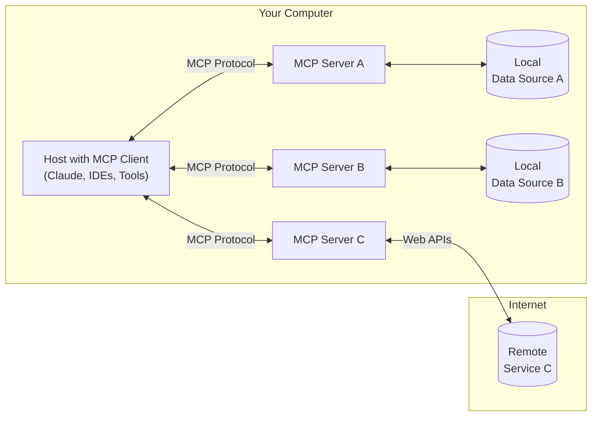

<div align="center">

# Pet Chi 桌面萌宠

_✨ MCP(提示词方式)，Qt6 ✨_

</div>


## 特性

- **Qt**: Qt6 框架实现的可视化图形界面
- **OpenAI 风格**: 使用 OpenAI `completions`接口，兼容绝大多数 LLM 服务提供者
- **MCP**: 支持 MCP 调用外部工具
  - 基于提示词方式实现，不依赖 function call
  - 已经支持的服务类型
    - Python
    - Node.js

## 初始化项目

如果你没有安装 uv：

```sh
pip install uv
```

创建虚拟环境

```sh
uv venv
```

激活虚拟环境

<details open>
<summary>On Windows:</summary>

```sh
.venv\Scripts\activate
```

</details>

<details open>
<summary>On Unix or MacOS:</summary>

```sh
source .venv/bin/activate
```

</details>

安装依赖

```sh
uv pip compile pyproject.toml > requirements.txt
uv pip install -r requirements.txt
```

## 配置

依据实际情况修改配置

```Python
class Config(BaseModel):
    # LLM 密钥
    api_key: str = ""
    # LLM url
    llm_url: str = "https://openrouter.ai/api/v1/chat/completions"
    # 模型
    model: str = "deepseek/deepseek-chat-v3-0324:free"
    # mcp server 路径
    mcp_server_path: str = "path/to/mcp/server/server.py"
    # 代理
    proxy: str = "http://127.0.0.1:7890"
```

## 运行

```sh
run
```

## MCP



## TODO

- [ ] 多 live2d 形象切换
- [ ] 多 MCP 服务连接
- [ ] 命令执行许可按钮
- [ ] 语音输入
- [ ] 语音输出
- [ ] 用户预设提示词
- [ ] 长期记忆
